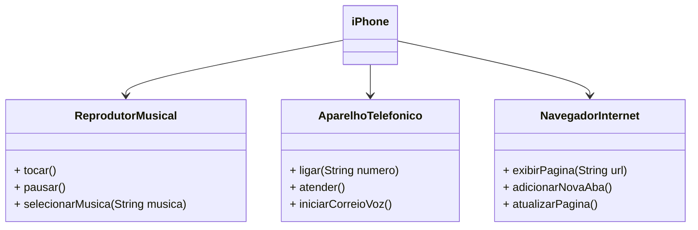

### Modelagem e Diagramação de um Componente iPhone

## 📋 Descrição

Neste desafio proposto no curso de Java da Digital Innovation One, deveremos modelar e diagramar a representação UML do componente iPhone, abrangendo suas funcionalidades como Reprodutor Musical, Aparelho Telefônico e Navegador na Internet. Cada funcionalidade será mapeada com métodos específicos que simulam operações comuns realizadas por um iPhone.

#### Funcionalidades a Modelar

1. **Reprodutor Musical**
   - Métodos: `tocar()`, `pausar()`, `selecionarMusica(String musica)`
2. **Aparelho Telefônico**
   - Métodos: `ligar(String numero)`, `atender()`, `iniciarCorreioVoz()`
3. **Navegador na Internet**
   - Métodos: `exibirPagina(String url)`, `adicionarNovaAba()`, `atualizarPagina()`

### Objetivo

1. Criar um diagrama UML que represente as funcionalidades descritas acima.
2. Implementar as classes e interfaces correspondentes em Java.

### Exemplo de Diagrama UML (Mermaid)

### 💡Instruções

Clone o Repositório: Use o comando abaixo no seu terminal para clonar o repositório:

`git clone https://github.com/ErnandesNeponuceno/java-uml_diagrama`

Navegue até a pasta do projeto e abra-o na sua IDE Java favorita.

Baseie-se no diagrama UML para implementar as classes e interfaces necessárias.
